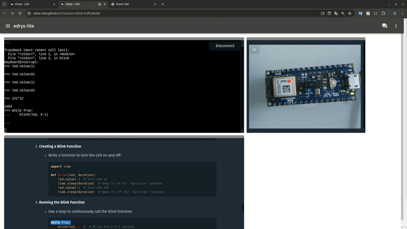

# Lab - WebSerial

This can be used as a starter laboratory for any kind of labs that are implemented with a serial connection.
This lab uses the WebSerial API to connect to your device and send commands to it.
For demonstration purposes, we used a MicroPython on a Arduino Nano 33 IoT board, but it can be any kind of board or experiment that uses a serial connection.

> **Note:** In order to use WebSerial, the browser that runs in Station-mode hast to be Google-Chrome, since this is the only browser that supports the WebSerial API at the moment. Yout students however can use any browser to connect to the station.

## Lab Configuration

This lab uses 3 modules only:

1. [module-serial](https://github.com/edrys-labs/module-serial): This module is used to connect to the serial port of the device.
2. [module-markdown-it](https://github.com/edrys-labs/module-markdown-it): This module is used to render the markdown content of the lab.
3. [module-station-stream](https://github.com/edrys-labs/module-station-stream): This module is used to send a video stream from the station module to all connected users.

---

If you already have created a new classroom at:

https://edrys-labs.github.io

then simply copy the following URL and import the lab configuration:

https://raw.githubusercontent.com/edrys-labs/lab-web-serial/main/laboratory/micropython.yaml

... Otherwise try out the fast deploy by clicking onto the Deploy-Button.
This will load the configuration automatically within your browser.
The created classroom will be unique and can be shared with your students.

## Demo

https://github.com/edrys-labs/lab-web-serial/assets/3089101/90057461-c96f-42d5-a002-c2d4b105f81a

